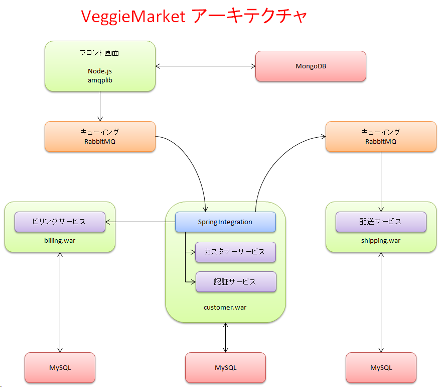

VeggieMarket
============

##### CustomerModel (廃棄済み)
##### ShoppingSite（未定）
* Seleniumテストあり
* 中身が家電なので修正予定

### Customerプロジェクト
* 認証サーバー
* 顧客データベース等のORM(Object Relational Mapper) Hibernate使用
* 単体・結合テストを使ったTDD/XP/Scrum
* Mockito/JUnit4/MockMvc/dbunit + Stub + ContextConfiguration(DIのテストもあり)
* 予定：Spring Batch/Taskの追加を予定
* 現在：未実装
* 予定：Spring Integration(nodeプロジェクトからRabbitmq経由で送られてきたメッセージを加工してBillingプロジェクトに送信）
* 現在：Spring Integration(nodeプロジェクトからRabbitmq経由で送られてきたメッセージをコンソールに出力・加工しRabbitMQに送信)
* port番号:8040

### nodeプロジェクト（Node.js）
* Backbone.js / jQuery / underscore
* Node.js+RabbitMQのためのAMQPアダプター
* 元々はBlog系のアプリとして設計・実装したが、フロントエンドとして再設計中
* jasmineによる単体テストあります（まだTDDではないので今後に検討）
* coffeescript+Sass+Jade+Grunt
* * port番号:9100

### integrationプロジェクト
* EAI/EIP サーバー
* Spring Integrationサーバー

### Billingプロジェクト
* 予定：Spring Integration（Customerプロジェクトから送られてきたメッセージをRabbitma経由でShippingプロジェクトに送信）
* 現在：未実装

### Shippingプロジェクト
* 予定:Spring Integration（CustomerプロジェクトからRabbitmq経由で送られてきたメッセージをコンソールに出力）
* 現在：未実装

###アーキテクチャ
---

---

